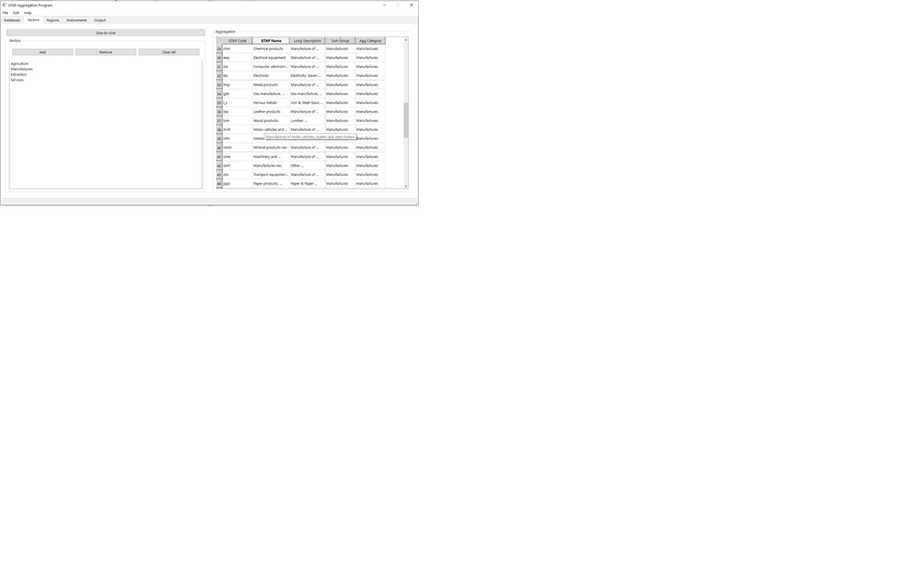

Running an Aggregation
----------------------

An aggregation in PyGTAPAgg proceeds in much the same way as using the legacy GTAPAgg2. There are major differences, which are subtle, and the user may not realize they are different, so emphasis will be added at those points. In general, GTAPAgg is a highly structured program, with data files having to be located in specific directory structures or the application will not see them. PyGTAPAgg was designed to be more flexible in specifying GTAP databases by simply pointing the system to a set of files. The system will do initial checks to be sure the essential data are available. Another point of difference is the use of the .agg files in GTAPAgg2 and prior versions. These were tab delimited files which had to be read in by GEMPACK using a rigid data structure. PyGTAPAgg employs the .json data format in common use today. JSON files are semi-structured data sets, which means there is no limit to the additional data which can be combined in the files, as long as the basic REG, PROD_COMM, TRAD_COMM, and ENDW_COMM source fields are present. Additionally, an aggregation file can contain regions and sectors from any current or past GTAP database version, the values will be matched up in accordance with the names in the database pointed to and nonmatches result in values in the data tabs without associated descriptions.

Application Overview
--------------------

The application is made up of a system menu which includes File, Edit and Help (see Figure 1). The File menu allows the user to Open, Save, Save As and Quit the application (properly quitting will save any settings which have been changed, such as the current working directory etc.).

   Figure 1: Opening Screen

   Figure 2: File Menu

Choosing a Database (Data Tab)
--------------------------------

An aggregation is started by selecting "Choose GTAP Database" (Figure 1). Navigate to the folder containing the GTAP Database to be aggregated. 
After choosing a database, the Databases tab will reflect the version, year, release data, number of regions, number of sectors and number of 
endowments in the database selected (see Figure 3). If a database without a valid format is selected, a warning will be raised with information 
about why the database is not valid.

   Figure 3: Choose GTAP Database

Sector Mapping (Sector Tab)
-----------------------------

Figure 4 shows the sectors tab. The right-hand pane shows the current state of the aggregation of sectors. In this example, there are five columns of data, which is different from the legacy application GTAPAgg2. We see the benefits of the JSON file format. The furthest right column is always the aggregation definition. The first column are the GTAP sectors. In between these two columns can be any data the user wishes to put in the JSON file, it will appear in this pane. Unlike GTAPAgg2, clicking on a column header will sort the data on that column, much as a spreadsheet. This allows for quick grouping and checking data. Next, a user can highlight multiple rows, and right click on them, like a spreadsheet and "paste" a value into all the cells. A menu with valid sector aggregations will appear.

   Figure 4: Sectors Tab

The headers may be resized or hidden, as in a spreadsheet. Hovering over a row will provide a long description of the GTAP sector.

   Figure 5: Hovering for Descriptions

Regional Mapping (Region Tab)
-------------------------------

Figure 6 shows the regional tab. It functions in a similar way to the sector tab. Features such as sorting based on headings, paint and paste fill-in, and augmenting fields for sorting are also included. Users may wish to change the .json file to include their own regional groupings. Like the Sectors tab, only the first and last columns must be specific data: the first column is the GTAP region codes and the last column is the aggregation codes.

   Figure 6: Hovering for Descriptions

Endowment Mapping (Endowment Tab)
---------------------------------

Figure 7 shows the endowment mapping tab. This tab includes an extra frame to change the corresponding endowment mobility parameters. The aggregation frame works in a similar way as the sector and region aggregation frames, the first and last columns are the key information: the GTAP endowment code and the endowment aggregation on the right. Values in the middle may be used to sort and inform the user's aggregation decisions. Adding or removing a value from the "Endowments" frame adjusts the "Parameters" frame accordingly.

   Figure 7: Endowment Mapping

Creating a New Database (Output Tab)
------------------------------------

Figure 8 shows the database output tab. This is where the user specifies the location of the aggregated files on their system. Click on Set Aggregation Directory and choose any valid directory on your system. The location will be indicated in the Target Directory for Aggregation Files space at the top of the tab.

   Figure 8: Database Output Tab

Running the aggregation will bring up a status window, so the user can see the progress of the aggregation. Although the aggregation process looks the same as GTAPAgg2, it is different in PyGTAPAgg for several reasons and hence why the status window is important. In the past, running an aggregation would occasionally fail and it would take time examining log files to understanding where in the aggregation process something went wrong. The status window provides immediate feedback to the user on the progress of the various aggregation programs. Perhaps more importantly, PYGTAPAgg employs multithreading to implement concurrent processes (parallel processing). This greatly speeds up the aggregation of large data sets, since processes do not have to be run in a series and can utilize the now common, numerous cores on a computer. It's important to understand that some of the aggregation programs may at times try to access the same files before they are released by another system. This may cause an error (race conditions are very hard to predict). While these types of errors are no more common than any other run time processes, they may occur; the user must be aware of when a process did not complete. Rerunning the aggregation will usually solve the error. In the case a program "hangs" for some reason (it could be a race condition, a runtime error in the aggregation program, the data etc.), the user will have to press "terminate" to execute a termination signal to the operating system.

   Figure 9: Aggregation Status

Finally, to view the files, the standard process of opening up the directory and using viewHar is the recommended method. PyGTAPAgg does not maintain a separate viewing application for HAR files.

Numerous process protections and careful sequencing of concurrent processes have been undertaken to minimize these events, but they cannot, in theory, be eliminated without greatly reducing the advantages (speed) or multithreading the operations.